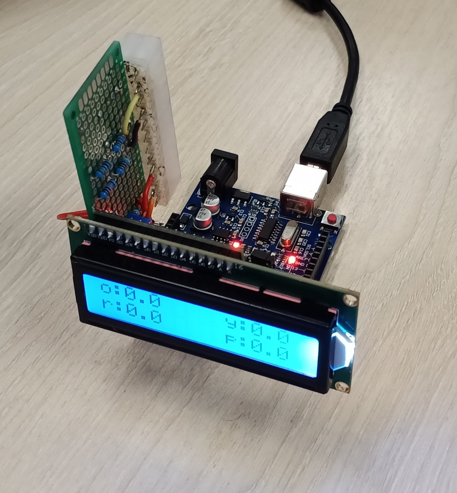
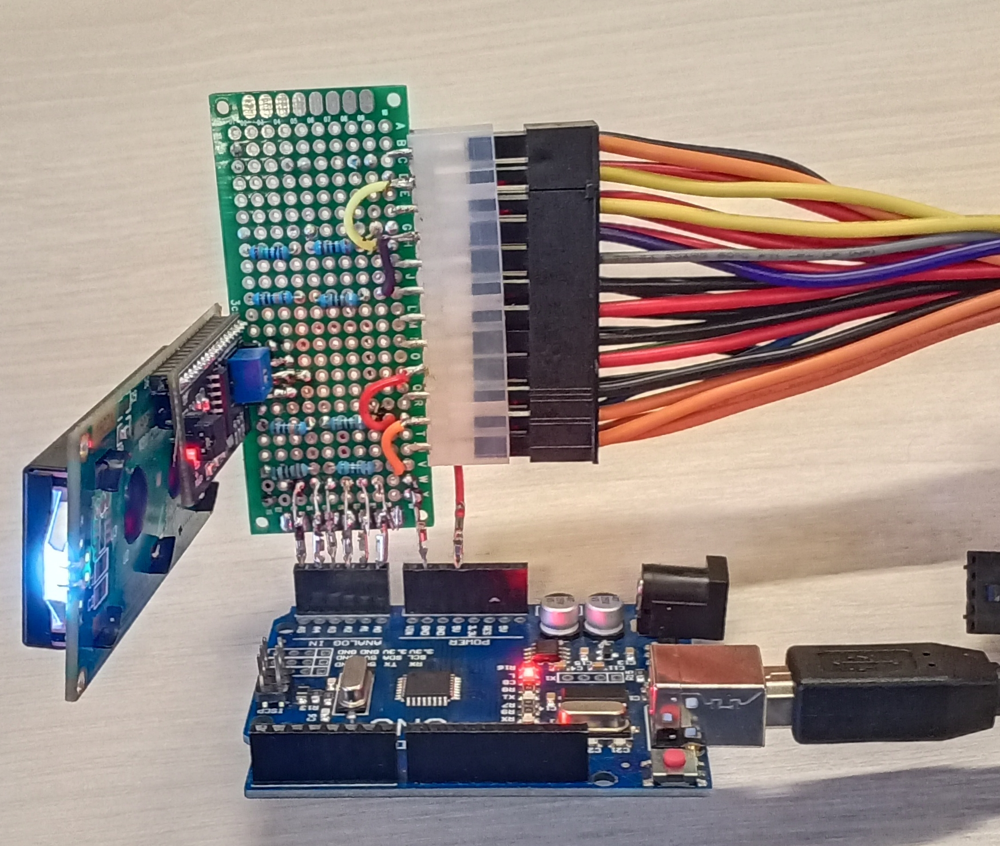
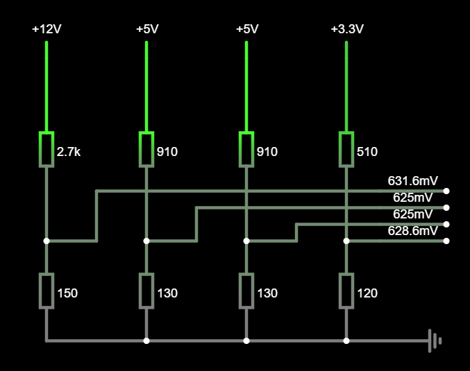
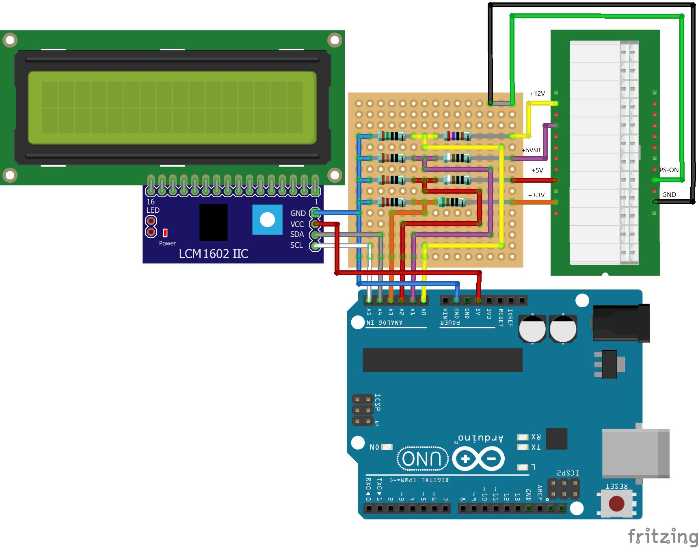

## Тестирование ATX с микроконтроллера Atmega328

Устройство реализовано на базе платы **Arduino uno** компилятор **Avr-gcc**.

Для начала тестирование следует: 
- подсоеденить блок питания по ATX к распаянному делителю напряжения 
- Включить блок питания 

Информация о текущих напряжениях передаётся: 
- в СОМ-порт (стандартный интерфейс, распаянный на плате; Скорость 19200 8n1); 
- на Lcd дисплей 

Обозначения, используемые при передаче: 
1.o - orange - 3.3v 
2.r - red - 5v 
3.p - purple - 5v 
4.y - yellow - 12v 

